# Creating a new ES index for a new simiplified with only one cluster

```mermaid
graph LR
    subgraph Client
        UI[UI]
    end

    subgraph Platform Api
        WikiController[WikiController]
        ElasticSearchInitJob[ElasticSearchInitJob]
        ElasticSearchJob[ElasticSearchJob]
    end

    subgraph PlatformMW
        API[API Endpoint]
        UpdateSearchIndexConfig[UpdateSearchIndexConfig]
    end

    subgraph Elasticsearch
        ES[Elasticsearch Cluster]
    end

    UI -- HTTP --> WikiController
    WikiController -- Dispatches--> ElasticSearchInitJob
    ElasticSearchInitJob -- calls method on parent --> ElasticSearchJob
    ElasticSearchJob -- HTTP Request using curl --> API
    API -- executes --> UpdateSearchIndexConfig
    UpdateSearchIndexConfig --> ES
```


# Creating a new ES index oon two different clusters, one write only and the other being read from and written to
```mermaid
graph LR
   subgraph Client
       UI[UI]
   end

   subgraph Platform_Api
       WikiController[WikiController]
       ElasticSearchInitJob[ElasticSearchInitJob]
       ElasticSearchJob[ElasticSearchJob]
   end

   subgraph Backend Internal Mediawiki
       API[API Endpoint]
       UpdateSearchIndexConfig[UpdateSearchIndexConfig]
       EnvVars[Default and Write Only Env Vars]
   end

   subgraph Elasticsearch_Clusters
       ES1[Elasticsearch Cluster 1]
       ES2[Elasticsearch Cluster 2]
   end

   UI -- HTTP --> WikiController
   WikiController -- Dispatches --> ElasticSearchInitJob
   ElasticSearchInitJob -- calls method on parent --> ElasticSearchJob
   ElasticSearchJob -- HTTP Request using curl --> API
   API -- executes --> UpdateSearchIndexConfig
   UpdateSearchIndexConfig --> ES1
   UpdateSearchIndexConfig --> ES2
   EnvVars --> UpdateSearchIndexConfig
   ```
