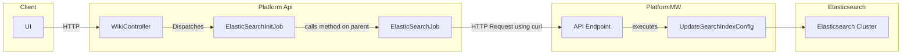

# Creating a new ES index for a new wiki

```mermaid
graph LR
    subgraph Client
        UI[UI]
    end

    subgraph Platform Api
        WikiController[WikiController]
        ElasticSearchInitJob[ElasticSearchInitJob]
        ElasticSearchJob[ElasticSearchJob]
    end

    subgraph PlatformMW
        API[API Endpoint]
        UpdateSearchIndexConfig[UpdateSearchIndexConfig]
    end

    subgraph Elasticsearch
        ES[Elasticsearch Cluster]
    end

    UI -- HTTP --> WikiController
    WikiController -- Dispatches--> ElasticSearchInitJob
    ElasticSearchInitJob -- calls method on parent --> ElasticSearchJob
    ElasticSearchJob -- HTTP Request using curl --> API
    API -- executes --> UpdateSearchIndexConfig
    UpdateSearchIndexConfig --> ES
```
