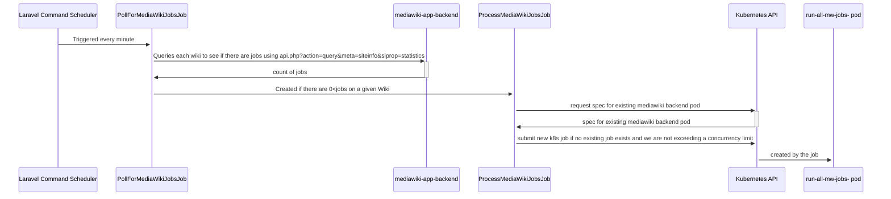

MediaWiki jobs are run in in kubernetes jobs.

They are triggered to run by this api. See the following sequence diagram for an overview of how this works.

```mermaid
sequenceDiagram
    Laravel Command Scheduler->>+PollForMediaWikiJobsJob: Triggered every minute
    PollForMediaWikiJobsJob->>+mediawiki-app-backend: Queries each wiki to see if there are jobs using api.php?action=query&meta=siteinfo&siprop=statistics
    mediawiki-app-backend->>-PollForMediaWikiJobsJob: count of jobs
    PollForMediaWikiJobsJob->>+ProcessMediaWikiJobsJob: Created if there are 0<jobs on a given Wiki
    ProcessMediaWikiJobsJob->>+Kubernetes API: request spec for existing mediawiki backend pod
    Kubernetes API->>-ProcessMediaWikiJobsJob: spec for existing mediawiki backend pod
    ProcessMediaWikiJobsJob->>+Kubernetes API: submit new k8s job if no existing job exists and we are not exceeding a concurrency limit
    Kubernetes API->>+run-all-mw-jobs- pod: created by the job
```
